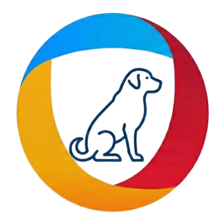

# Cy Bee 🐝

A desktop RAG (Retrieval-Augmented Generation) application for analyzing customer discovery interview data. Built with Tauri v2, Rust, React, and Tailwind CSS.



## Features

- **CSV & Excel Import**: Load interview data from `.csv`, `.xlsx`, `.xls`, `.xlsm`, and `.xlsb` files
- **Semantic Search**: Uses embeddings to find relevant interview snippets
- **AI-Powered Analysis**: Ask questions about your data and get insights with source citations
- **Local LLM Support**: Runs entirely on your machine using Ollama - no data leaves your computer
- **Model Selection**: Choose from any chat model available in your Ollama installation

## Prerequisites

- [Ollama](https://ollama.ai/) installed and running
- Required Ollama models:
  ```bash
  ollama pull nomic-embed-text  # Required for embeddings
  ollama pull llama3.2          # Or any other chat model
  ```

## Installation

### From Release (Ubuntu/Debian)

Download the `.deb` package from the [Releases](https://github.com/davey-mason/cy-bee/releases) page and install:

```bash
sudo dpkg -i cy-bee_0.1.0_amd64.deb
```

### From Source

1. **Install dependencies**:
   ```bash
   # Node.js & npm
   # Rust & Cargo
   # Tauri prerequisites: https://v2.tauri.app/start/prerequisites/
   ```

2. **Clone and build**:
   ```bash
   git clone https://github.com/davey-mason/cy-bee.git
   cd cy-bee
   npm install
   npm run tauri build
   ```

3. **Run in development**:
   ```bash
   npm run tauri dev
   ```

## Usage

1. **Start Ollama** (if not already running):
   ```bash
   ollama serve
   ```

2. **Launch Cy Bee** from your application menu or run `cy-bee`

3. **Select a chat model** from the dropdown

4. **Load your data**: Click "Select Folder" and choose a directory containing your CSV/Excel files

5. **Ask questions**: Type your question and get AI-powered insights with source citations

## Tech Stack

- **Frontend**: React, TypeScript, Tailwind CSS v4, Vite
- **Backend**: Rust, Tauri v2
- **AI/ML**: rig-core, Ollama (local LLMs)
- **Data Processing**: csv, calamine (Excel support)

## Project Structure

```
cy-bee/
├── src/                    # React frontend
│   ├── App.tsx            # Main UI component
│   ├── api.ts             # Tauri command wrappers
│   └── index.css          # Tailwind styles
├── src-tauri/             # Rust backend
│   ├── src/
│   │   ├── lib.rs         # Tauri entry point
│   │   ├── state.rs       # Application state
│   │   ├── commands/      # Tauri commands
│   │   └── rag/           # RAG implementation
│   └── Cargo.toml
└── public/                # Static assets
```

## License

MIT

## Acknowledgments

Built for [Inis Informatics](https://inisinformatics.com) customer discovery research.
